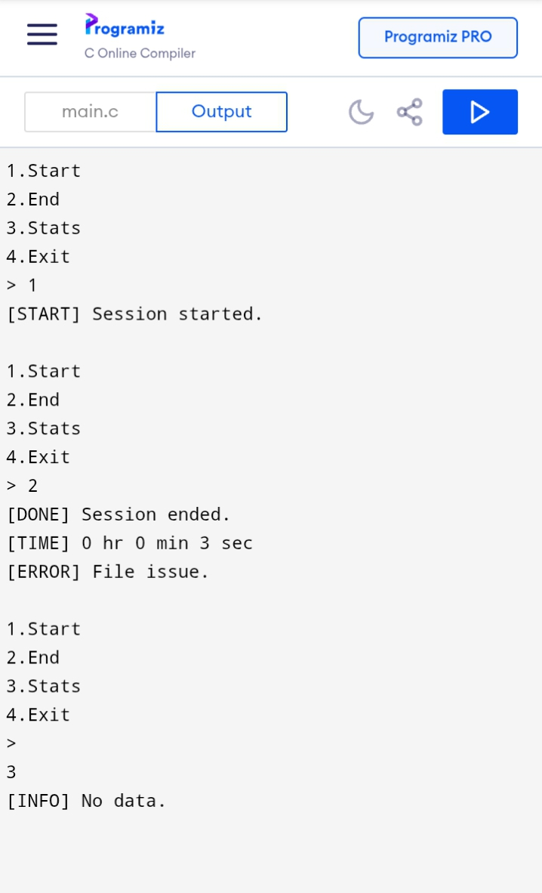

# Focus Tracker CLI

A command-line application written in C to track focus sessions and measure productivity.

---

## 🚀 Features
- Start and end focus sessions
- Calculate total focus time
- Store session data in a file
- View overall statistics

---

## 🛠️ Tech Stack
- C Programming
- File Handling
- time.h library

---

## ▶️ How to Run

1. Compile the code:
   gcc main.c -o focus

2. Run the program:
   ./focus

---

## 📁 Project Structure
focus-tracker-cli/
│── main.c
│── log.txt
│── README.md

---
## 📊 Sample Output

## ⚠️ Note
File handling may not work in some online compilers.
Run the program locally for full functionality.

---

## 🔮 Future Improvements
- Daily tracking system
- Streak counter
- Data visualization

---

## 👤 Author
Prabhakar 
